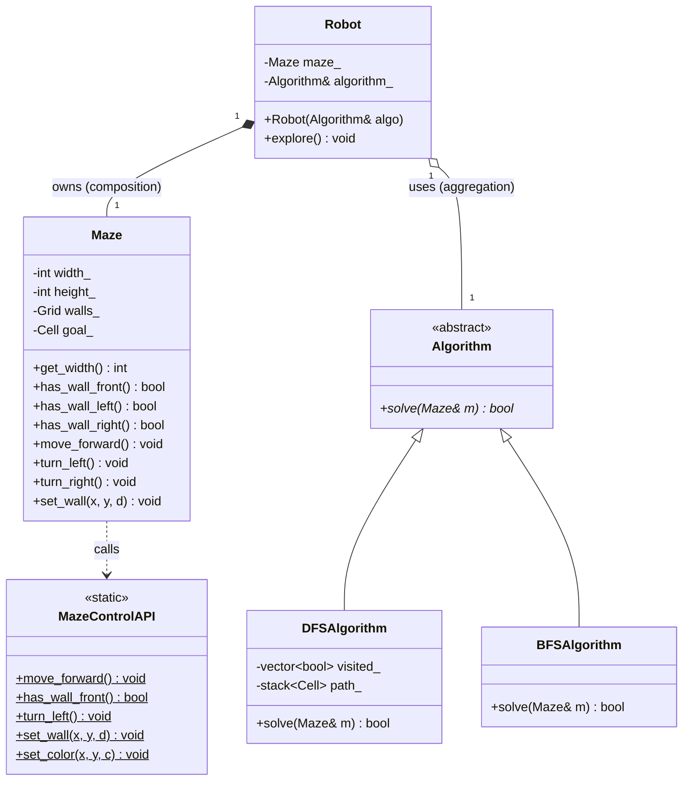
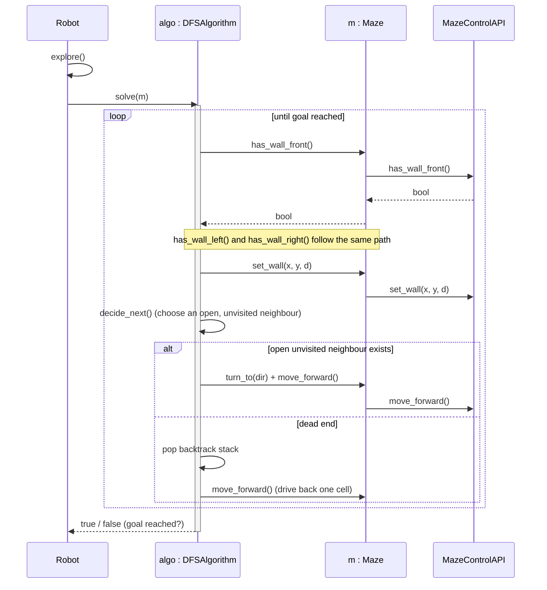

# MicroMouse — Maze Navigation Robot

> A simulated autonomous robot that explores an unknown maze, maps it as it
> goes, and finds its way to the goal. Written in modern **C++17**.


## What it does

Drop the robot into a maze it has never seen. It can only feel the walls
directly around it — front, left, right — and can only step one cell at a time
relative to the way it's facing. From nothing but that, it:

- **explores** the maze, sensing and recording walls as it moves,
- **builds** an internal map from those observations, and
- **finds a path** from the start cell to the goal using depth-first search
  with real, physical backtracking.

I built this to get hands-on with two things I find genuinely interesting:
designing a clean object-oriented architecture from scratch, and implementing a
classic search algorithm under a real-world constraint that textbooks usually
ignore — **a robot can't teleport back to where it came from; it has to drive.**

This README walks through how it's built, in the order I built it: **design →
behaviour → data structures → implementation.**

---

## Table of contents

- [MicroMouse — Maze Navigation Robot](#micromouse--maze-navigation-robot)
  - [What it does](#what-it-does)
  - [Table of contents](#table-of-contents)
  - [Design: architecture](#design-architecture)
  - [Design: class diagram](#design-class-diagram)
  - [Design: behaviour](#design-behaviour)
  - [The algorithm](#the-algorithm)
    - [Data structures](#data-structures)
    - [The exploration loop](#the-exploration-loop)
  - [Implementation](#implementation)
  - [Build \& run](#build--run)
  - [Project layout](#project-layout)
  - [What I learned](#what-i-learned)
  - [Possible improvements](#possible-improvements)

---

## Design: architecture

I modelled the system before writing any code, so the responsibilities and
relationships were explicit up front. Each class does exactly one thing:

| Class | Responsibility |
| --- | --- |
| `MazeControlAPI` | The low-level interface to the simulator. All static methods. The only code allowed to talk to the simulator directly. |
| `Maze` | The robot's internal world-model **and** the single wrapper around `MazeControlAPI`. Holds known walls, dimensions, the goal, and the robot's pose. Every simulator command funnels through here. |
| `Algorithm` | An **abstract** base class defining *what* a solver does (`solve()`), not *how*. |
| `DFSAlgorithm` | A concrete solver — the *how*. Owns the search state (visited set + backtrack stack). |
| `Robot` | The controller. Owns its `Maze` and hands the thinking off to whatever `Algorithm` it's given. |

Three relationships hold the design together:

- **Composition** — `Robot` *owns* its `Maze`. The maze is part of the robot's
  state and is destroyed with it. (filled diamond ◆)
- **Aggregation** — `Robot` *uses* an `Algorithm` handed in from outside. The
  robot doesn't own the algorithm's lifetime, so a strategy can be swapped or
  shared. (hollow diamond ◇)
- **Inheritance + polymorphism** — `DFSAlgorithm` *is an* `Algorithm`. `Robot`
  holds the base type and calls `solve()` through it, so the concrete strategy
  is resolved at runtime. Swapping in a different search needs zero changes to
  `Robot`.

One rule I held throughout: **only `Maze` ever touches `MazeControlAPI`.** The
algorithm and robot never call it directly — everything is routed
`Algorithm → Maze → MazeControlAPI`. That keeps all the simulator coupling in
exactly one place, and it's reflected consistently in both diagrams.

---

## Design: class diagram



---

## Design: behaviour

This sequence shows one exploration pass at runtime. Notice how every sense/move
call is delegated through `Maze` to the API, and how the `alt` fragment captures
the core decision: step into an open neighbour, or hit a dead end and back out.



---

## The algorithm

The robot solves the maze with **depth-first search**. The interesting twist
over a textbook graph DFS is the physical constraint: when the search hits a
dead end, the robot can't just "return" to an earlier node — it has to *drive
back there*. That one fact decides the data structures.

### Data structures

- **Cell identity** — each `(x, y)` is flattened into a single integer:
  `index = y * width + x`. A "set of cells" becomes "an array indexed by int."
- **Visited set** — `std::vector<bool>` sized `width * height`. O(1) lookup,
  marked the first time a cell is entered. This is **permanent memory**.
- **Backtrack stack** — a stack of cells holding the **current path from start
  to wherever the robot is now**. Each entry also records the direction it was
  entered from, so backtracking knows exactly how to reverse a step.

> The idea I like most here: *visited* is permanent, the *stack* is just the
> current route. When the robot reaches the goal, the stack **is** the solution
> path — every dead end has already been popped off. I never compute the path
> separately; the data structure hands it back for free.

Directions are numbered `0=N, 1=E, 2=S, 3=W` with offset tables
`dx = {0, 1, 0, -1}`, `dy = {1, 0, -1, 0}`, so a neighbour is
`(x + dx[d], y + dy[d])` and turns are just modular arithmetic on the direction
number. Since the API is robot-relative (`has_wall_front`, `turn_left`) but the
search reasons in absolute directions, a thin translation layer converts a
target direction into the right sequence of turns.

### The exploration loop

At the current cell, each iteration:

1. **Sense** the walls (front / left / right) and **record** them in the `Maze`.
2. **Decide:** check the four neighbours. A neighbour is a *candidate* if
   there's no wall between it and the current cell **and** it hasn't been
   visited. (This is where "blocked" is decided — by the search, not the API.)
3. **If a candidate exists** → turn to face it, move forward, mark it visited,
   **push** it on the stack.
4. **If none exists** → dead end. **Pop** the stack and drive back one cell.
5. **Stop** at the goal (or when the stack empties, meaning no path exists).

Because the visited set already records what's been explored, there's no need to
track per-cell "which directions did I already try" — a backtracked cell just
finds its explored neighbours marked visited and skips them automatically.

---

## Implementation

The code maps one-to-one onto the design:

- `Maze` wraps `MazeControlAPI` and maintains the internal wall map and pose.
- `Algorithm` is the abstract interface; `DFSAlgorithm` implements `solve()`
  and holds the visited vector and backtrack stack as private members.
- `Robot` composes a `Maze`, takes an `Algorithm&`, and runs `explore()`.

Standard: **C++17**.


---

## Build & run

Runs inside a MicroMouse simulator such as
[`mms`](https://github.com/mackorone/mms).

```bash
cd maze_navigation
mkdir build && cd build
cmake ..
make
```

Then, in the simulator: create a mouse, point its run command at the compiled
binary, pick a maze, and start.

---

## Project layout

```
maze_navigation/
├── CMakeLists.txt
├── images/
│   ├── maze.gif            # demo of the robot solving the maze
│   ├── maze.png            # screenshot
│   └── maze.webm           # raw recording
├── include/
│   ├── maze_api.hpp        # provided simulator API (do not modify)
│   └── maze_navigation.hpp # Maze, Algorithm, DFSAlgorithm, Robot
└── src/
    ├── maze_api.cpp        # provided simulator API implementation
    ├── maze_navigation.cpp # all class implementations
    └── main.cpp            # entry point
```

---

## What I learned

- **Designing for change pays off.** Because `Robot` depends on the abstract
  `Algorithm`, adding a second strategy (see below) is a drop-in — no controller
  changes. Polymorphism stopped being a textbook word and became a practical lever.
- **Encapsulating the one "dirty" dependency** (the simulator API) behind a
  single class kept the rest of the code clean and testable in my head.
- **The right data structure can be the answer.** Letting the backtrack stack
  double as the solution path was the moment the algorithm clicked.

## Possible improvements

- **Shortest path:** DFS finds *a* path, not the *shortest*. A `BFSAlgorithm`
  (the interface is already there) or a flood-fill would find the optimal route
  — a natural next strategy to plug in.
- **Two-phase run:** explore first, then do a fast optimal run on the known map.
- **Diagonal moves / speed optimisation** for a more competition-style solver.

---

