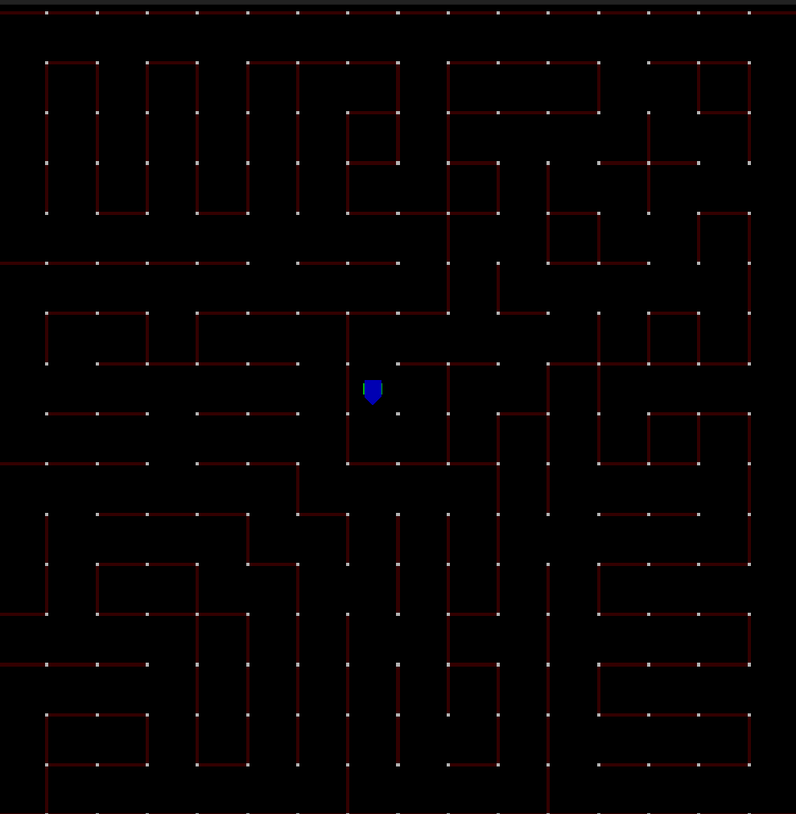

# Autonomous Maze Navigation

## MicroMouse DFS Navigation

A C++17 implementation of autonomous maze navigation using Depth-First Search (DFS). The robot explores a 16×16 maze, discovers walls, and navigates to the center goal cells using a stack-based DFS with backtracking.

### Maze Navigation Demo



### Architecture

- **Maze** — internal world model and sole wrapper around `MazeControlAPI`
- **Algorithm** — abstract base with pure virtual `solve(Maze&)`
- **DFSAlgorithm** — concrete DFS solver using a backtrack stack
- **Robot** — owns a `Maze`, aggregates an `Algorithm`, drives the solve loop

---

A micromouse maze navigation project containing maze files and tooling for algorithm development, simulation, and testing.

## Repository Structure

```
.
└── mazefiles/          # Micromouse maze files in text format
    ├── classic/        # 16x16 competition mazes
    ├── halfsize/       # 32x32 half-size competition mazes
    └── training/       # Smaller mazes for local testing
```

## Maze File Format

Mazes are stored as plain text using the following conventions:

- `o` — post at every grid intersection
- `---` — horizontal wall
- `|` — vertical wall
- `S` — start cell
- `G` — goal cell

Example 4x4 maze:

```
o---o---o---o---o
| G |           |
o   o   o   o---o
|       |       |
o---o---o---o   o
|               |
o   o---o---o   o
| S |           |
o---o---o---o---o
```

## Maze Categories

| Category  | Grid Size | Notes |
|-----------|-----------|-------|
| classic   | 16×16     | Standard competition format; goal at cell (7,7) |
| halfsize  | 32×32     | Goal is a single marked cell, position varies |
| training  | varies    | Smaller mazes for local testing; active area noted in filename |

## Running Tests

Requires Python 3 and pytest.

```bash
python -m pytest
```

## Contributing

Maze files may contain errors or duplicates. If you spot an issue, open a GitHub issue — a photo of the original maze is especially helpful for corrections.

To contribute new mazes or fixes, fork the repo and submit a pull request.
